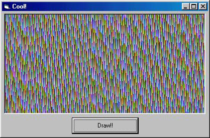

<div align="center">

## nice grafix


</div>

### Description

The code draws a nice texture in a PictureBox. I don't know what it could be used for, but perhaps you ... ;)
 
### More Info
 
it's easy: just make a new form with a picturebox (6000 x 3000 twips) and a button (cmdDraw) then copy this code.


<span>             |<span>
---                |---
**Submitted On**   |
**By**             |[Daniel Quernheim](https://github.com/Planet-Source-Code/PSCIndex/blob/master/ByAuthor/daniel-quernheim.md)
**Level**          |Advanced
**User Rating**    |4.7 (14 globes from 3 users)
**Compatibility**  |VB 3\.0
**Category**       |[Graphics](https://github.com/Planet-Source-Code/PSCIndex/blob/master/ByCategory/graphics__1-46.md)
**World**          |[Visual Basic](https://github.com/Planet-Source-Code/PSCIndex/blob/master/ByWorld/visual-basic.md)
**Archive File**   |[](https://github.com/Planet-Source-Code/daniel-quernheim-nice-grafix__1-10326/archive/master.zip)


### Source Code

```
Private Sub cmdDraw_Click()
Dim r As Byte
Dim g As Byte
Dim b As Byte
Dim rI As Integer
Dim gI As Integer
Dim bI As Integer
Dim i As Integer
Dim ii As Integer
Randomize Timer
r = Int(Rnd * 2)
g = Int(Rnd * 4)
b = Int(Rnd * 6)
For i = 1 To 400 * 15 Step 15
 For ii = 1 To 200 * 15 Step 15
  Picture1.PSet (i, ii), RGB(r, g, b)
  rI = r + 1 + Int(Rnd * 3)
  If rI > 255 Then r = rI - 255 Else r = rI
  gI = g + 2 + Int(Rnd * 4)
  If gI > 255 Then g = gI - 255 Else g = gI
  bI = b + 3 + Int(Rnd * 5)
  If bI > 255 Then b = bI - 255 Else b = bI
 Next ii
Next i
End Sub
```

